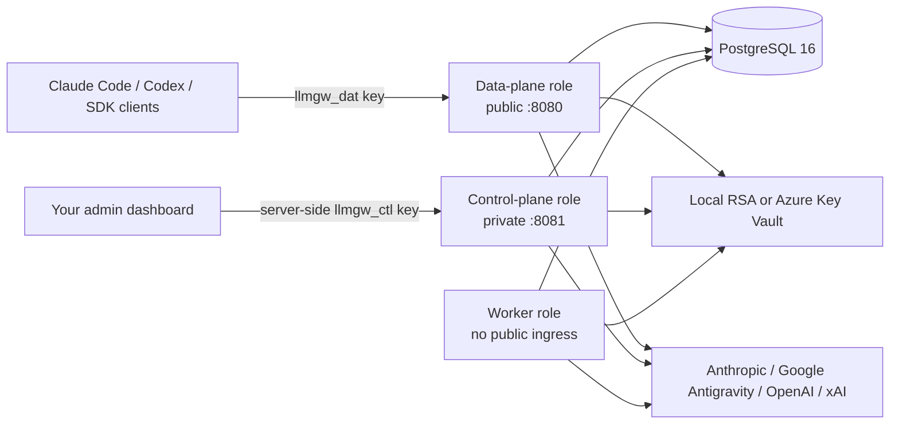

# LLM Gateway

Self-host Claude Code, Codex CLI/Desktop, OpenAI Codex subscription, Claude,
xAI, and Google Antigravity subscription traffic behind one
provider-extensible, multi-account gateway.

LLM Gateway discovers models from connected accounts, publishes one client
catalog, preserves provider-native protocols where possible, and routes each
request according to configurable quota, weight, priority, and sticky-session
policies. One revocable data key works with both Anthropic Messages and Codex
Responses clients.

> [!IMPORTANT]
> LLM Gateway is an independent community project. It is not affiliated with,
> endorsed by, or supported by Anthropic, Google, OpenAI, or xAI. Consumer
> subscription transports are private compatibility surfaces and may change at
> any time. You are responsible for complying with every provider's terms and
> policies.

## Why a standalone service?

- Provider OAuth credentials never enter the database or process of the app
  integrating the gateway.
- Public inference and private administration can be deployed and scaled
  separately.
- Any dashboard can integrate through a versioned control API or the included
  server-side TypeScript client.
- The same OCI image runs on Azure, Kubernetes, another container platform, or
  bare metal.
- Adding a provider does not require adding a PostgreSQL enum or scattering
  provider branches throughout the router.

## Architecture



The default `all` role runs these surfaces together for easy self-hosting.
Production installations should expose only the data plane and keep the
control plane on a private network.

## Capabilities

- Multiple accounts per provider with quota-aware load balancing.
- Google Antigravity OAuth with managed-project isolation, live model
  discovery, Codex-native reasoning effort selection, and model-family quota
  windows.
- Per-account direct or Claude Agent SDK execution for Anthropic; direct is the
  default and both modes may coexist in one routing pool.
- `QUOTA_BALANCED`, `WEIGHTED_SHARE`, `LEAST_UTILIZED`, and
  `PRIORITY_FAILOVER` routing.
- Sticky sessions to protect prompt-cache affinity.
- Per-account, routing-member, routing-pool, and client-key concurrency/usage
  controls.
- Live provider model discovery—no bundled client model list.
- Anthropic Messages, count-tokens, Codex Responses, Codex model catalog, and
  standalone Codex web search.
- Cross-provider Codex catalog and sub-agent model injection.
- Envelope-encrypted OAuth credentials and hash-only client/control keys.
- Metadata-only request history and redacted control audit history.
- Explicit migration job, background quota refresh, and bounded retention.
- Legacy `arcgw_*` key and `/api/llm-gateway` path compatibility.

The optional Agent SDK path runs through a private, pinned Meridian sidecar.
It forwards client tools for execution by Claude Code or Codex, caps SDK work
at the tool boundary, and keeps the selected profile sticky. See
[`deploy/agent-sdk`](deploy/agent-sdk/README.md).

Codex Desktop currently ties Remote Control visibility to OpenAI-authenticated
model providers. The optional macOS
[`codex-auth-bridge`](addons/codex-auth-bridge/README.md) preserves the local
ChatGPT identity for Remote Control while replacing that credential with a
Keychain-backed gateway data key before any inference request leaves loopback.
All models continue to route through LLM Gateway.

## Five-minute Docker quick start

Requirements: Docker with Compose, OpenSSL, and two free local ports (8080 and
8081). PostgreSQL is bound to loopback on port 55433.

```bash
git clone https://github.com/OpenSource03/llm-gateway.git
cd llm-gateway

secret_dir="${XDG_DATA_HOME:-$HOME/.local/share}/llm-gateway"
install -d -m 700 "$secret_dir"
if [[ ! -f "$secret_dir/wrap-key.pem" ]]; then
  openssl genpkey -quiet -algorithm RSA -pkeyopt rsa_keygen_bits:3072 \
    -out "$secret_dir/wrap-key.pem"
fi
if [[ ! -f "$secret_dir/session-hmac" ]]; then
  openssl rand -hex 32 > "$secret_dir/session-hmac"
fi
if [[ ! -f "$secret_dir/database-password" ]]; then
  openssl rand -hex 24 > "$secret_dir/database-password"
fi
chmod 600 \
  "$secret_dir/wrap-key.pem" \
  "$secret_dir/session-hmac" \
  "$secret_dir/database-password"

export GATEWAY_LOCAL_RSA_KEY_PATH="$secret_dir/wrap-key.pem"
export GATEWAY_SESSION_HMAC_SECRET="$(<"$secret_dir/session-hmac")"
export POSTGRES_PASSWORD="$(<"$secret_dir/database-password")"
export GATEWAY_UID="$(id -u)"
export GATEWAY_GID="$(id -g)"

docker compose -f deploy/compose/compose.yml up -d --build
```

Create the first control key. It is shown once and never stored in plaintext:

```bash
docker compose -f deploy/compose/compose.yml run --rm gateway \
  node dist/cli.js control-keys create \
  --name local-admin \
  --owner "Local operator"
```

Export that key only in the operator shell:

```bash
export LLM_GATEWAY_CONTROL_URL=http://127.0.0.1:8081/admin/v1
export LLM_GATEWAY_CONTROL_KEY='llmgw_ctl_...'
curl -fsS -H "Authorization: Bearer $LLM_GATEWAY_CONTROL_KEY" \
  "$LLM_GATEWAY_CONTROL_URL/status"
```

The control port is loopback-only in the Compose file. Do not publish it
through your public reverse proxy.

## Connect subscription accounts

Start an authentication attempt through the control API:

```bash
curl -fsS -X POST \
  -H "Authorization: Bearer $LLM_GATEWAY_CONTROL_KEY" \
  -H 'Content-Type: application/json' \
  -d '{"provider":"anthropic"}' \
  "$LLM_GATEWAY_CONTROL_URL/oauth-attempts"
```

- Anthropic returns an authorization URL. After approval, paste the displayed
  authorization code into `POST /oauth-attempts/{id}/complete` as
  `{ "authorization_code": "..." }`.
- Google Antigravity uses the same completion endpoint. Open its Google sign-in
  URL, approve access, then paste either the authorization code or the complete
  final `localhost:51121/oauth-callback?...` URL. A browser error at that
  loopback address is expected when the gateway runs on another machine; copy
  the URL from the address bar.
- Google may require an additional account check when a subscription is first
  used from a new machine or network. Authorized operators can call
  `POST /accounts/{id}/verify-access`; if action is required, the control plane
  returns a short-lived, host-validated Google URL. Complete it and call the
  endpoint again. Verification URLs are never exposed on the data plane.
- OpenAI and xAI use device authorization. Open the verification URL, enter
  the displayed code, then call `POST /oauth-attempts/{id}/poll` at the
  indicated interval.

After building from source,
`node apps/gateway/dist/cli.js provider-login <provider>` drives the same flow
interactively: it prompts for paste-code providers and automatically polls
device-code providers. Use `--no-wait` when an external dashboard will finish
the attempt.

Refresh `/models`, create routing pools/members, then create a data-plane key.
The complete contract is available at the private
`/admin/v1/openapi.json` endpoint and in
[`packages/admin-client`](packages/admin-client).

## Use Claude Code

Set the data-plane root—not `/v1`:

```bash
export ANTHROPIC_BASE_URL='https://gateway.example.com'
export ANTHROPIC_AUTH_TOKEN='llmgw_dat_...'
export ANTHROPIC_API_KEY=''
export CLAUDE_CODE_ENABLE_GATEWAY_MODEL_DISCOVERY=1
export CLAUDE_CODE_DISABLE_UNKNOWN_MODEL_WINDOW_ENFORCEMENT=1
export ENABLE_TOOL_SEARCH=true
claude
```

`ENABLE_TOOL_SEARCH=true` is important for non-first-party base URLs; without
it Claude Code may inline a very large MCP/plugin catalog on every turn.

## Use Codex CLI or Desktop

Keep the data key in the environment, not in TOML:

```bash
export LLM_GATEWAY_DATA_KEY='llmgw_dat_...'
```

Add to `~/.codex/config.toml`:

```toml
model = "anthropic/claude-opus-5"
model_provider = "llm_gateway"
web_search = "live"
suppress_unstable_features_warning = true

[features]
standalone_web_search = true

[code_mode]
direct_only_tool_namespaces = ["web"]

[model_providers.llm_gateway]
name = "LLM Gateway"
base_url = "https://gateway.example.com/v1"
env_key = "LLM_GATEWAY_DATA_KEY"
wire_api = "responses"
requires_openai_auth = false
supports_standalone_web_search = true
```

Codex Desktop uses the same user-level provider configuration as the CLI.
Platform-specific setup, including persistent macOS Keychain authentication,
is documented in [docs/clients.md](docs/clients.md).

## Integrate another dashboard

Use a private BFF. Never put a `llmgw_ctl_*` key in browser JavaScript:

```bash
pnpm add https://github.com/OpenSource03/llm-gateway/releases/download/v0.1.0/opensource03-llm-gateway-admin-client-0.1.0.tgz
```

```ts
import { GatewayAdminClient } from "@opensource03/llm-gateway-admin-client";

const gateway = new GatewayAdminClient({
  baseUrl: process.env.LLM_GATEWAY_CONTROL_URL!,
  apiKey: () => process.env.LLM_GATEWAY_CONTROL_KEY!,
  actor: () => ({
    id: currentUser.id,
    email: currentUser.email,
    name: currentUser.name,
  }),
});

const accounts = await gateway.listAccounts();
```

Create that integration key with only the needed scopes and
`can_delegate_actors=true`. The gateway records both the credential ID and the
delegated human actor in its own audit database. See
[docs/integrations.md](docs/integrations.md).

`control-keys:write` is a root-equivalent scope because it can mint another
control credential with broader permissions. Do not grant it to ordinary
dashboard integrations.

## Deployment

| Target                          | Included assets                          | Recommended topology                                   |
| ------------------------------- | ---------------------------------------- | ------------------------------------------------------ |
| Local/bare metal                | Docker Compose, Caddy, systemd           | `all`, control bound to loopback                       |
| Kubernetes                      | Helm chart + NetworkPolicies             | separate data/control/worker                           |
| Azure                           | Container Apps Bicep example             | external data, internal control, worker, migration job |
| ECS, Cloud Run, other OCI hosts | OCI image + generic environment contract | separate roles where supported                         |

PostgreSQL is mandatory. Redis is not required: leases, concurrency, usage
reservations, sticky routes, and scheduled-job election use PostgreSQL.

TLS terminates at your ingress/reverse proxy. Run migrations explicitly with
the migrator image and a DDL-capable connection; give runtime roles only DML.

## Security model

- Provider tokens are AES-256-GCM encrypted under random per-row data keys.
- Data keys are wrapped by an owner-only RSA key or immutable Azure Key Vault
  RSA key version.
- Data/control keys contain 256 random bits; PostgreSQL stores only SHA-256
  hashes and short display prefixes.
- Authentication happens before request-body parsing.
- Provider hosts are pinned in adapter code; database/client values cannot
  select an upstream URL.
- Upstream failures are sanitized before reaching clients.
- Prompts, outputs, reasoning, tool inputs/results, OAuth codes, and raw tokens
  are never persisted or logged.
- Control keys are scoped, revocable, expirable, optionally CIDR-bound, and
  actor delegation is opt-in.

CIDR restrictions require `GATEWAY_TRUSTED_CLIENT_IP_HEADER` to name a header
that your sole ingress overwrites (`x-azure-clientip` or `x-real-ip`). Without
that deployment guarantee, leave the setting and CIDR list empty; caller-owned
forwarding headers are intentionally ignored.

Read [SECURITY.md](SECURITY.md) and [docs/threat-model.md](docs/threat-model.md)
before exposing the service.

## Development

```bash
corepack pnpm install
corepack pnpm typecheck
corepack pnpm test
corepack pnpm build
```

Database integration tests require a disposable local database named
`llm_gateway_test`; see [CONTRIBUTING.md](CONTRIBUTING.md).

Provider compatibility is deliberately isolated behind adapter contracts. See
[docs/provider-adapters.md](docs/provider-adapters.md) before adding one.

## Known limitations

- Subscription transports and model metadata may change without notice.
- Anthropic's current private Claude Code CCH/continuity implementation cannot
  be reproduced byte-for-byte; only observed, accepted wire behavior is used.
- Agent SDK accounts use local token-count estimates because the bridge does
  not expose Anthropic's count-tokens endpoint. Native Anthropic server tools
  are also unavailable through subscription-backed Agent SDK execution;
  Codex's client-side web tools remain available through the gateway.
- OpenAI pooled subscription routing cannot honestly advertise first-party
  Desktop Fast/Priority behavior when the upstream reports the default tier.
- Encrypted OpenAI/xAI reasoning cannot be converted into Anthropic thinking
  signatures without loss.
- xAI requires a real account smoke test before relying on it in production.
- Google Antigravity is a private compatibility surface. Its models are never
  bundled by the gateway; an account must complete a live catalog refresh
  before any Antigravity model is published. Image-output models are omitted
  because neither supported public client protocol can faithfully return their
  binary assistant output. Provider-internal catalog entries without a
  user-facing display name are also omitted. Native Google Search grounding is
  not advertised until its citations and tool history can round-trip through
  both client protocols without loss.

## License

Apache License 2.0. See [LICENSE](LICENSE).
